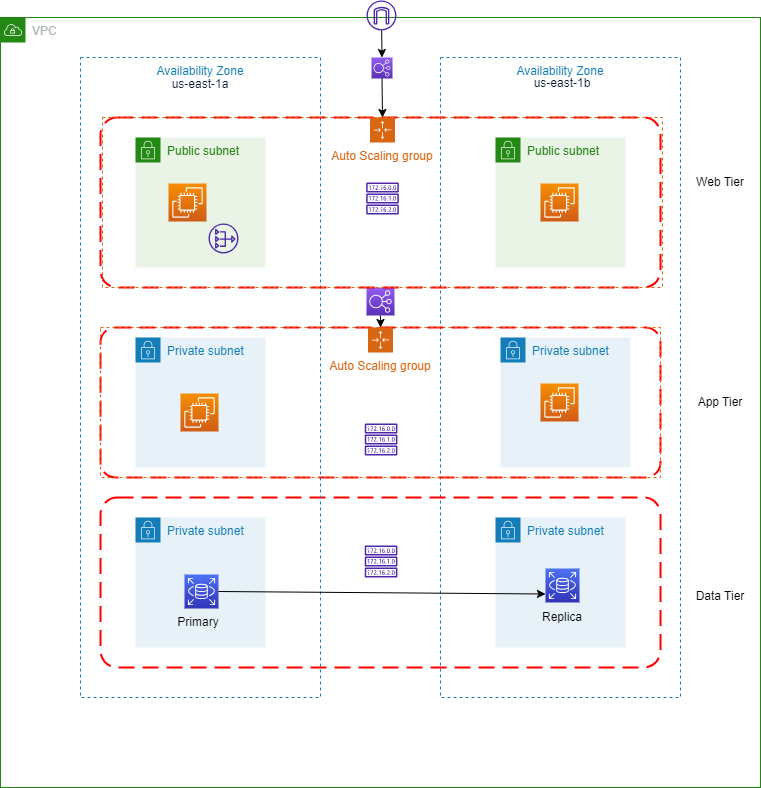

# Terraform AWS 3-Tier Application Provisioning

This repository contains Terraform configurations to provision a 3-tier application on Amazon Web Services (AWS). It leverages Terraform modules for modularized resource management.

## Prerequisites

- **Terraform**: Make sure you have Terraform [installed](https://www.terraform.io/downloads.html) on your local machine.
- **AWS Credentials**: Configure your AWS credentials with the necessary permissions.

# The Architecture

This is just a basic architecture of a three tier-architecture I have built for now. Over the next few weeks I will be adding alittle bit of something to improve the architecture to conform to the well architecured framework and add more functionalities and services that AWS has to offer.

Monitoring with Cloud Watch, Auditing with Cloud Trail,IAM for user and Access management you name it.
## Getting Started

1. **Clone the Repository**:

   ```bash
   https://github.com/charity-bit/3-tier-project
   cd 3-tier-project
2. **Initialize Terraform**:

    ```bash
    terraform init
    ```
    
    **Planning**
   
    Before applying the configuration, it's a good practice to review the changes that Terraform will make to your infrastructure. You can do this by running:

    ```bash
    terraform plan
    ```
  
    **Usage**

    Customize the deployment by adding a .tvars file and entering the values of your variables. 
    To apply the configuration and provision AWS resources, run:
    ```bash
    terraform apply
    ```
      

    This project is structured into separate Terraform modules for better organization and reusability:

    1. **networking**: Manages the VPC, subnets.

    2. **ec2_asg**: Handles EC2 instance provisioning and     configuration using launch template and sets up Auto Scaling Groups for handling EC2 instance scaling.

    3. **load_balancers**: Configures load balancers for distributing traffic.

    4. **route_tables**: Manages custom route tables for your VPC.

    5. **rds**: Sets up Amazon RDS for your application's database.

    6. **security_group**: Manages security groups for controlling inbound and outbound traffic.
    
    7. **target_group**: Creates Target Groups for routing traffic to specific instances behind the load balancer.


